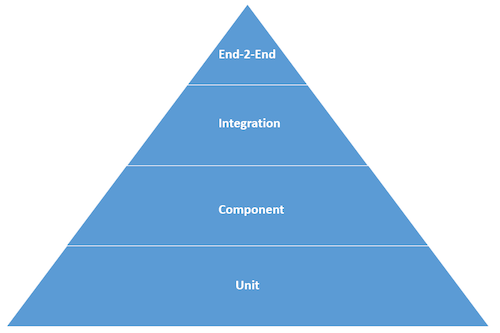

after-work.js is designed to be your preferred choice when it comes to testing. It acts as an unified testing framework from the lowest level up to the system level.

[](http://martinfowler.com/bliki/TestPyramid.html)

More details on how to use the framework can be found in [Using after-work.js](./docs/usage.md) there every level of the test pyramid is explained.

Or you can go directly to the different test levels:
* [unit](./docs/unit.md): used for testing business logic and business rules without interaction with UI components at all.
* [component](./docs/component.md): used for testing interaction with components on isolated part of the system (fixtures that contains stubs, spies, mocks).
* [integration](./docs/integration.md): used for testing interaction with components that communicates with peer components.
* [system / end to end](./docs/e2e.md): used for testing a flow scenario of the whole product.

## Get started
after-work.js is designed to be used as a dependency while developing your code. Just add it as a `devDependencies` to your `package.json`:

```js
"devDependencies": {
  "after-work.js": "^2.0.0"
}
```

You can also accomplish this by running `npm install --save-dev after-work.js`

## Contributing

Please follow the instructions in [CONTRIBUTING.md](.github/CONTRIBUTING.md).
