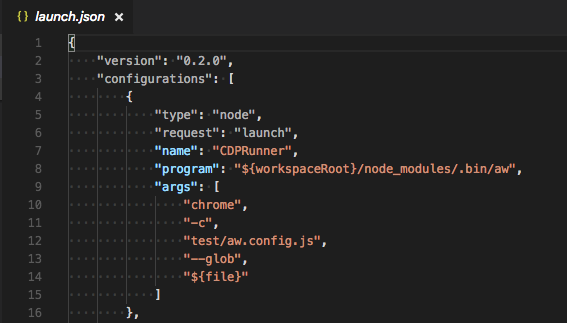

[](https://circleci.com/gh/qlik-oss/after-work.js)
[](https://renovatebot.com/)
[](https://coveralls.io/github/qlik-oss/after-work.js?branch=master)

`after-work.js` is an unified test framework highly configurable through cli and configuration files allowing tests to be executed in the desired context.

# Deprecated

`after-work.js` is deprecated. Here are some alternatives:

- Vitest: <https://vitest.dev/>
- Jest: <https://jestjs.io/>
- Ava: <https://github.com/avajs/ava>
- Testing-library: <https://testing-library.com/>
- Playwright: <https://playwright.dev/>
- Cypress: <https://www.cypress.io/>

## Requirements

### Default runner

* [node](./docs/node.md#node): Node.js >= 12.x

### Context dependent

* [cdp](./docs/cdp.md#cdp) (Chrome Debugging Protocol): Chrome > 61
* [protractor](./docs/protractor.md#protractor-config) (webdriver protocol): protractor 5.x + browser(s)
* [puppeteer](https://github.com/GoogleChrome/puppeteer) (High-level Headless Chrome Node API - experimental): puppeteer

## Introduction

`after-work.js` aims to be a tool that facilitates the testing while development or restructuring code.
Designed for test and provide fast feedback on changed code and added testcases.

To configure `after-work.js` you need to start with an analyse of the code.
* What context should it be executed in (Node.js, browser)
* What type of tests should be executed (unit, component, integration, e2e)
* Does the code have any dependencies to build or run (babel...)

## Get started

### Installation

Install the module using npm:

```sh
npm install --save-dev @after-work.js/aw
```

### CLI entrypoint

`after-work.js` is CLI and consists of a command together with appropriate options
Help is always available with the `--help, -h` option

```sh
npx aw -h
npx aw chrome -h
npx aw protractor -h
npx aw serve -h
npx aw puppeteer -h
```

 | Command    | Description                                     | Alias  | Default | Experimental |
 | ---------- | ----------------------------------------------- | ------ | :-----: | :----------: |
 | node       | Run tests in node.                              |        | x       |              |
 | cdp        | Run tests in Chrome (chrome devtools protocol). | chrome |         |              |
 | protractor | Run tests with Protractor.                      | ptor   |         |              |
 | serve      | Serve files.                                    |        |         |              |
 | puppeteer  | Run tests with Puppeteer.                       | puppet |         | x            |

---

All commands support passing a config file for all options.

```sh
npx aw -c ./path/to/aw.config.js
```

However, passing an option from command line will override the config file option.

```sh
npx aw -c ./path/to/aw.config.js --glob /path/that/overrides/glob/in/config/file
```

This enables easy debugging setup from modern editors for example [Visual Studio Code](https://code.visualstudio.com/)



This will only run the current active file. And you don't have to worry about your tests timing out
since `after-work.js` will automatically detect running a debugger and set the appropriate options accordingly.

## Included Tools

The following tools are bundled into after-work.js:

* [Mocha](https://mochajs.org/): an extensible testing framework for TDD or BDD.
* [Chai](http://chaijs.com/): an assertion library used together with a JavaScript testing framework.
* [Sinon](http://sinonjs.org/): a framework for standalone test spies, stubs and mocks for JavaScript.
* [Nyc](https://istanbul.js.org/): the Istanbul command line interface

## Contributing

Please follow the instructions in [CONTRIBUTING.md](.github/CONTRIBUTING.md).

## Publish to npm

1. `npx lerna version --exact --no-push --no-git-tag-version --force-publish`
2. Update all `@after-work.js/*` dependencies in the root package.json to match the new version
3. `git commit -m "chore(release): publish vX.Y.Z"`
4. `git tag -a vX.Y.Z -m "vX.Y.Z"`
5. `npx lerna publish from-git`
6. `git push --follow-tags`
