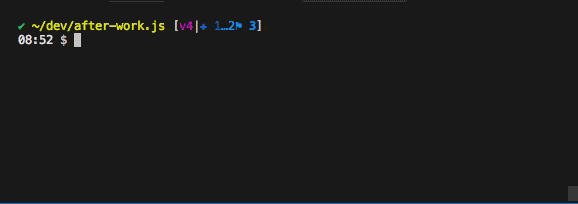
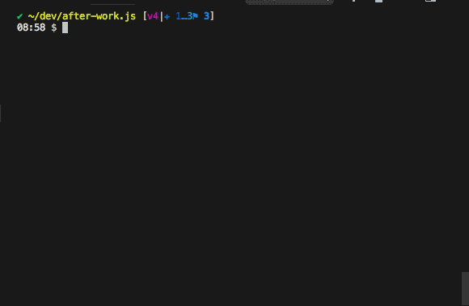
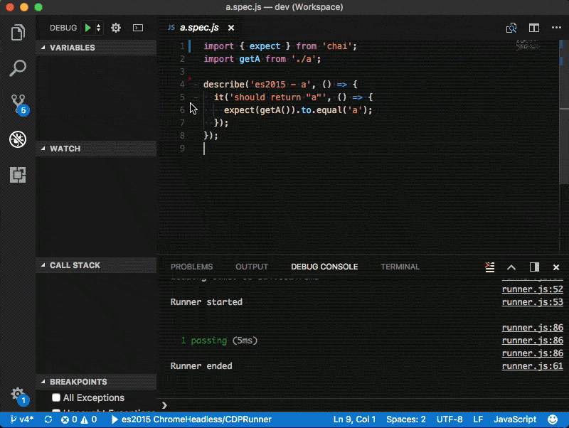
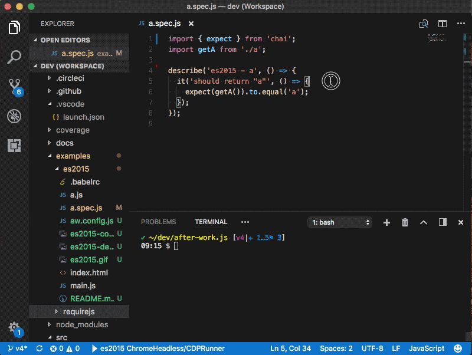

# This is a sample for es2015 and requirejs

## From the project root run

```shell
./src/cli.js chrome -c examples/es2015/aw.config.js
```

`aw.config.js`

```javascript
module.exports = {
  url: 'http://localhost:9676/examples/es2015/index.html',
  glob: ['examples/es2015/*.spec.js'],
  'transform.include': ['examples/es2015/*.js'],
};

```



## Generating coverage

To be able to generate coverage we need to serve the files with a http server and instrument the source files

```shell
./src/cli.js chrome -c examples/es2015/aw.config.js --coverage
```



## Debugging

Using [vscode](https://code.visualstudio.com/)

Install [Debugger for Chrome](https://marketplace.visualstudio.com/items?itemName=msjsdiag.debugger-for-chrome)

Add configuration to launch Chrome and the `cdp` runner



If your favourite editor doesn't support chrome debugging you can pass the `chrome.devtools=true` option to run Chrome with `--auto-open-devtools-for-tabs`

```shell
./src/cli.js chrome -c examples/es2015/aw.config.js --chrome.devtools=true
```


