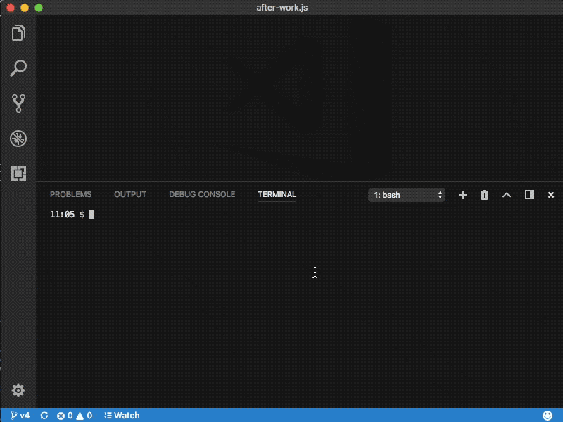
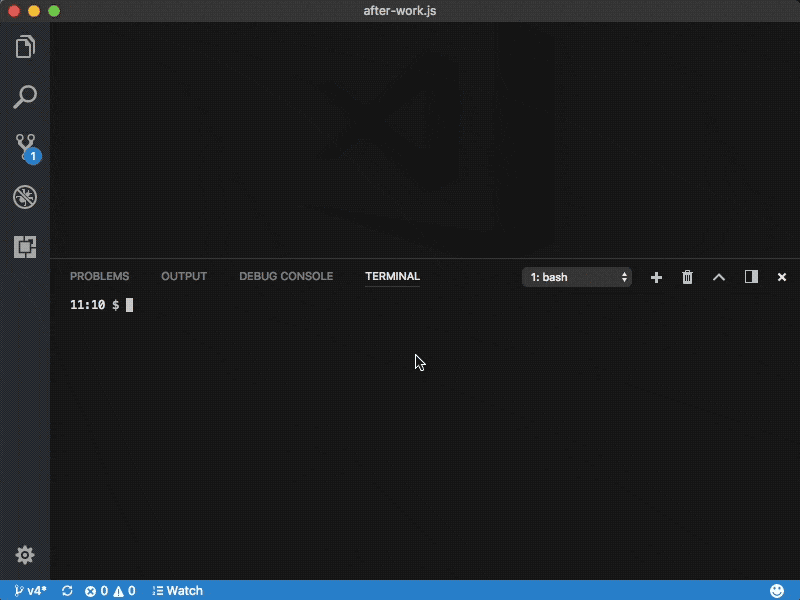
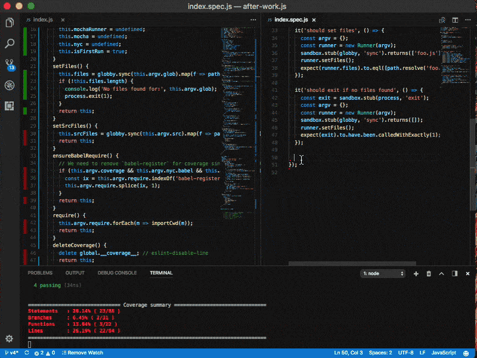

# This is a sample for node and `after-work.js`

## From the project root run

```shell
npm run test:node
```



Generate coverage

```shell
npm run test:coverage
```



```shell
./src/cli.js -c aw.config.js --coverage -w
```


